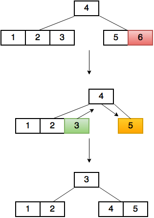
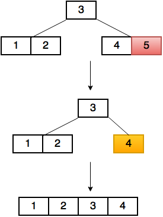

# B-Tree

A B-Tree is a self-balancing search tree, in which nodes can have more than two children.

### Properties

A B-Tree of order *n* satisfies the following properties:
 - Every node has at most *2n* keys.
 - Every node (except root) has at least *n* keys.
 - Every non-leaf node with *k* keys has *k+1* children.
 - The keys in all nodes are sorted in increasing order. 
 - The subtree between two keys *k* and *l* of a non-leaf node contains all the keys between *k* and *l*.
 - All leaves appear at the same level.

A second order B-Tree with keys from 1 to 20 looks like this:


### The representation of a B-Tree node in code

```swift
class BTreeNode<Key: Comparable, Value> {
  unowned var ownerTree: BTree<Key, Value>
  
  private var keys = [Key]()
  var children: [BTreeNode]?
  
  ...
}
```

The main parts of a node are two arrays:
 - An array containing the keys
 - An array containing the children


Nodes also have a reference to the tree they belong to.  
This is necessary because nodes have to know the order of the tree.

*Note: The array containing the children is an Optional, because leaf nodes don't have children.*

## Searching

1. Searching for a key `k` begins at the root node.
2. We perform a linear search on the keys of the node, until we find a key `l` that is not less than `k`,  
   or reach the end of the array.
3. If `k == l` then we have found the key.
4. If `k < l`: 
    - If the node we are on is not a leaf, then we go to the left child of `l`, and perform the steps 3 - 5 again.
    - If we are on a leaf, then `k` is not in the tree.
5. If we have reached the end of the array:
    - If we are on a non-leaf node, then we go to the last child of the node, and perform the steps 3 - 5 again.
    - If we are on a leaf, then `k` is not in the tree.

### The code

`valueForKey(_:)` method searches for the given key and if it's in the tree,  
it returns the value associated with it, else it returns `nil`.

## Insertion

Keys can only be inserted to leaf nodes.

1. Perform a search for the key `k` we want to insert.
2. If we haven't found it and we are on a leaf node, we can insert it.
 - If after the search the key `l` which we are standing on is greater than `k`:  
   We insert `k` to the position before `l`.
 - Else:  
   We insert `k` to the position after `l`.

After insertion we should check if the number of keys in the node is in the correct range.  
If there are more keys in the node than `order*2`, we need to split the node.

####Splitting a node

1. Move up the middle key of the node we want to split, to its parent (if it has one).  
2. If it hasn't got a parent(it is the root), then create a new root and insert to it.  
   Also add the old root as the left child of the new root.
3. Split the node into two by moving the keys (and children, if it's a non-leaf) that were after the middle key
   to a new node.  
4. Add the new node as a right child for the key that we have moved up.  

After splitting a node it is possible that the parent node will also contain too many keys, so we need to split it also.  
In the worst case the splitting goes up to the root (in this case the height of the tree increases).

An insertion to a first order tree looks like this:


### The code

The method `insertValue(_:forKey:)` does the insertion.
After it has inserted a key, as the recursion goes up every node checks the number of keys in its child.  
if a node has too many keys, its parent calls the `splitChild(_:atIndex:)` method on it.

The root node is checked by the tree itself.  
If the root has too many nodes after the insertion the tree calls the `splitRoot()` method.

## Removal

Keys can only be removed from leaf nodes.

1. Perform a search for the key `k` we want to remove.
2. If we have found it:
   - If we are on a leaf node:  
     We can remove the key.
   - Else:  
     We overwrite `k` with its inorder predecessor `p`, then we remove `p` from the leaf node.

After a key have been removed from a node we should check that the node has enough keys.
If a node has fewer keys than the order of the tree, then we should move a key to it,  
or merge it with one of its siblings.

####Moving a key to the child

If the problematic node has a nearest sibling that has more keys than the order of the tree,  
we should perform this operation on the tree, else we should merge the node with one of its siblings.

Let's say the child we want to fix `c1` is at index `i` in its parent node's children array.

If the child `c2` at index `i-1` has more keys than the order of the tree:  

1. We move the key at index `i-1` from the parent node to the child `c1`'s keys array at index `0`.
2. We move the last key from `c2` to the parent's keys array at index `i-1`.
3. (If `c1` is non-leaf) We move the last children from `c1` to `c2`'s children array at index 0.

Else:  

1. We move the key at index `i` from the parent node to the end of child `c1`'s keys array.
2. We move the first key from `c2` to the parent's keys array at index `i`.
3. (If `c1` isn't a leaf) We move the first children from `c2` to the end of `c1`'s children array. 



####Merging two nodes

Let's say we want to merge the child `c1` at index `i` in its parent's children array.

If `c1` has a left sibling `c2`:

1. We move the key from the parent at index `i-1` to the end of `c2`'s keys array.
2. We move the keys and the children(if it's a non-leaf) from `c1` to the end of `c2`'s keys and children array.
3. We remove the children at index `i` from the parent node.

Else if `c1` only has a right sibling `c2`:

1. We move the key from the parent at index `i` to the beginning of `c2`'s keys array.
2. We move the keys and the children(if it's a non-leaf) from `c1` to the beginning of `c2`'s keys and children array.
3. We remove the children at index `i` from the parent node.

After merging it is possible that now the parent node contains too few keys,  
so in the worst case merging also can go up to the root, in which case the height of the tree decreases.



### The code

- `removeKey(_:)` method removes the given key from the tree. After a key has been deleted,  
  every node checks the number of keys in its child. If a child has less nodes than the order of the tree,
  it calls the `fixChildWithLessNodesThanOrder(_:atIndex:)` method.  

- `fixChildWithLessNodesThanOrder(_:atIndex:)` method decides which way to fix the child (by moving a key to it,
  or by merging it), then calls `moveKeyAtIndex(keyIndex:toNode:fromNode:atPosition:)` or 
  `mergeChild(_:withIndex:toNodeAtPosition:)` method according to its choice.

## See also

[Wikipedia](https://en.wikipedia.org/wiki/B-tree)  
[GeeksforGeeks](http://www.geeksforgeeks.org/b-tree-set-1-introduction-2/)

*Written for Swift Algorithm Club by Viktor Szilárd Simkó*
